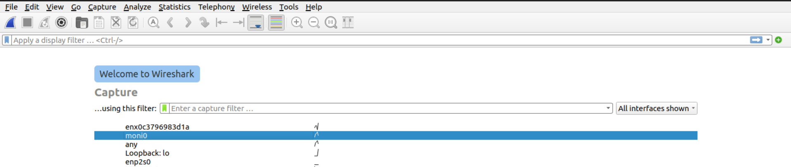
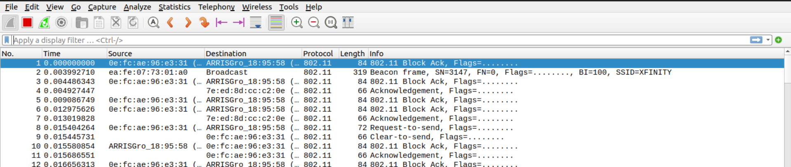
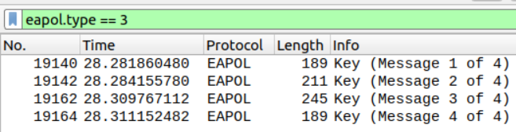

# WiFi Packet Capture on Linux

**NOTE:** This guide assumes you have admin access to the machine you're using.

## Overview
This guide walks you through how to configure and use a WiFi radio on a Linux system for WiFi packet capture. It assumes you are familiar with general networking concepts and are comfortable in a Linux terminal.

If you want more background information on WiFi, [these slides](./assets/lfnw2023_wifi_pcap.pdf) may prove useful (although they more targeted for presenting than offline reading).

## Table of Contents
1. [Definitions](#definitions)
2. [Setup for Packet Capture](#setup-for-packet-capture)
3. [Resetting Your WiFi](#resetting-your-wifi)
4. [6GHz Sniffing with AX210 Radios](#6ghz-sniffing-with-ax210-radios)
5. [References](#references)

## Definitions

Since networking and WiFi use so many acronymns and abbreviations (and I will use them in this guide), here's a list of some common terms and what they mean:

- **Radio:** The physical hardware used to communicate over WiFi.
- **Interface:** A logical abstraction created by an operating system for managing network devices. These can be virtual or physical.
- **STA (or station):** Any client that connects to an access point (AP).
- **vSTA (or virtual station):** Same as STA, but primarily used when discussing STA network interfaces on a system.
- **AP (or access point):** What most people refer to as a 'router'. A device used to connect to a WiFi network.
- **vAP (or virtual access point):** Same as AP, but primarily used when discussing AP network interfaces on a system.
- **Monitor:** A network interface used to perform packet capture.
- **Band:** A large slice of radio frequency (RF) spectrum available for use by WiFi. This includes 2.4GHz and 5GHz bands, as well as 6GHz band in some parts of the world.
- **Channel:** A pre-defined and regulated slice of a band which a STA and AP can use to transmit data.

## Setup for Packet Capture

### 1. Double-Check Some Things Before Starting

#### Ensure that your radio works for your use case

This can be somewhat challenging. The easiest method is to check the supported channels output [later in the guide](#71-verify-that-the-channel-you-want-to-sniff-is-supported). However, some radios have specific limitations that can be tricky to discover unless you know what to look for. When in doubt, read the kernel source (/s).

For example:
- An AX210 does 6GHz, but AX200 does not. Both are 802.11ax, but only the AX210 is WiFi 6E (AX200 is WiFi 6)
- A MTK7922 can do 160MHz channels, but MTK7921 can only do 80MHz
- An AX210 must first detect that it is in a regulatory domain which supports 6GHz in order to use it. There's a bit of a dance to get that done (see [this section](#6ghz-sniffing-with-ax210-radios))

#### Ensure you have a backup internet connection method

Creating a monitor mode interface as this guide instructs will disable your internet connection on its parent radio. **I recommend connecting to ethernet if possible.**

#### Ensure that your have admin access on machine

The commands used here will require `sudo` access.

#### Ensure no other programs will interfere

**NOTE:** **If you decide to delete the existing interface later on in this guide, this step is not necessary**. This step is only necessary if you intend to keep any managed network interface when doing WiFi packet capture. This is generally possible if you 'DOWN' the managed interface before using the monitor.

Assuming you do need to keep the existing wireless interface around, it is possible that other system programs will get in the way of your packet capture fun. **The likely culprit here is NetworkManager**, which is the de-facto network configuration tool on Linux these days. We don't want to disable NetworkManager entirely. Otherwise, you'll lose all internet access. We're going to instead instruct it to ignore the wireless interface we're going to use.

First, determine if NetworkManager is running. Next, determine if there are wireless network interfaces that use the radio you want to use (see [this section](#3-determine-radios-phy-name) and [this section](#41-find-all-interfaces-using-radio)). Finally, instruct NetworkManager to ignore the interface. The following demonstrates this process for an interface `wlan0`:
```Bash
# Check if NetworkManager is running (it is with PID 1072)
$ pgrep NetworkManager
1072

# Show devices visible to NetworkManager (note 'wlan0')
# Shorthand is `nmcli d`
$ nmcli device show
DEVICE           TYPE      STATE        CONNECTION         
enx0c3796983d1a  ethernet  connected    Wired connection 1 
wlan0            wifi      connected    wlancancan         
enp2s0           ethernet  unavailable  --                 
lo               loopback  unmanaged    --

# Print the wireless device's properties to verify that it is desired device.
#
# Here, I know my SSID is 'wlancancan' and NetworkManager names WiFi
# connections by their SSID by default. Thus, the 'GENERAL.CONNECTION' field
# matching 'wlancancan' tells me this is the right device.
$ nmcli device show wlan0
GENERAL.DEVICE:                         wlan0
GENERAL.TYPE:                           wifi
GENERAL.HWADDR:                         XX:XX:XX:XX:XX:XX
GENERAL.MTU:                            1500
GENERAL.STATE:                          100 (connected)
GENERAL.CONNECTION:                     wlancancan
GENERAL.CON-PATH:                       /org/freedesktop/NetworkManager/ActiveConnection/1
IP4.ADDRESS[1]:                         X.X.X.X/X
IP4.GATEWAY:                            X.X.X.X
IP4.ROUTE[1]:                           dst = X.X.X.X/X, nh = 0.0.0.0, mt = 600
IP4.ROUTE[2]:                           dst = 169.254.0.0/16, nh = 0.0.0.0, mt = 1000
IP4.ROUTE[3]:                           dst = 0.0.0.0/0, nh = X.X.X.X, mt = 600
IP4.DNS[1]:                             8.8.8.8
IP6.ADDRESS[1]:                         fe80::8fad:12b9:d5a8:e60b/64
IP6.GATEWAY:                            --
IP6.ROUTE[1]:                           dst = fe80::/64, nh = ::, mt = 1024

# Tell NetworkManager to stop managing the WiFi device we want to use
$ nmcli device set wlan0 managed false
```

If you’d like NetworkManager to explicitly ignore specific network interfaces or ignore network interfaces whose name matches a specific pattern, see [this guide](https://stackoverflow.com/questions/5321380/disable-network-manager-for-a-particular-interface).

### 2. Install Required Packages

In this guide, we'll use `iw` to configure the wireless monitor interface and Wireshark for performing and analyzing a packet capture. These are generally not installed by default on most Linux distros, though.
```Bash
# Debian/Ubuntu:
sudo apt install -y iw wireshark

# Fedora/RHEL:
sudo yum install -y iw wireshark
```

### 3. Determine Radio’s PHY Name

#### 3.1 Determine PCI bus of radio

```Bash
# Here the PCI bus is '03:00.0'
#
# May need to remove the pipe to grep and manually read output.
# Not all radios will appear w/ "Network controller" prefix.
$ lspci | grep Network
03:00.0 Network controller: MEDIATEK Corp. MT7921 802.11ax PCI Express Wireless Network Adapter
```

#### 3.2 Determine PHY name of radio

**NOTE:** You can use the [`list_interfaces.py`](./list_interfaces.py) script to both determine the PHY of the radio and all interfaces created on the radio. With this information in hand, you can then skip to the [Manage existing interfaces using radio](#42-manage-existing-interfaces-using-radio) section.

Find the `phyX` which matches the PCI bus found in the previous step:
```Bash
# Here the PHY is 'phy0'.
#
# May need to remove the grep here if no output appears.
# It's possible the uppermost portion of the PCI bus is non-zero.
$ ls -d /sys/class/ieee80211/*/device/driver/* | grep 0000 | sed -E 's|^.*(phy[^/]+)/.*/|\1 |'
phy0 0000:03:00.0
```

### 4. Manage Radio's Other Interfaces

As a bit of background, some radios support virtual interfaces on Linux (i.e. you can create multiple virtual stations or virtual APs). The limitation for these virtual stations (vSTA) and access points (vAP) is that they must all operate on the same channel and will likely not enable things like OFDMA.

Some radios, like the AX200 and AX210, do not support virtual interfaces at all on Linux. They only permit a single STA or AP (non-virtual) per radio (limited to 2.4GHz only for APs on AX200 and AX210s). Although, they do allow for a monitor to coexist on the same radio as a STA (monitors count a bit differently).

Thus, **ensuring that other network interfaces do not interfere** with the packet capture **depends on the radio you’re using**. My personal suggestion is to remove all network interfaces from the radio before creating the monitor, unless required not to (i.e. [6GHz sniffing on AX210](#6ghz-sniffing-with-ax210-radios)). This simplifies things if you need debug your configuration later on.

#### 4.1 Find all interfaces using radio

```Bash
# Use sysfs directory structure to get interfaces
# Example path: `/sys/class/ieee80211/phy0/device/net/wlan0`
#
# Taken from this StackExchange answer: https://unix.stackexchange.com/a/552995
$ ls /sys/class/ieee80211/*/device/net/* -d | sed -E 's|^.*(phy[^/]+)/.*/|\1 |'
phy0 wlan0
```

#### 4.2 Manage existing interfaces using radio

The command you run here depends on how you intend to configure the network interfaces which use the radio. You're likely to only have one interface
which uses the radio on your system, but if you find more, repeat your chosen step for each interface using the radio.

**Choose one:**
1. You want the monitor to be the only network interface using the radio.

    You only need to delete the existing interface. You will need to recreate it later if you want to reconnect to the internet
    using WiFi (see [this](#resetting-your-wifi) section).
    ```Bash
      # Deletes the 'wlan0' interface from the radio
      $ sudo iw dev wlan0 del
    ```

2. You want the keep the existing network interface which uses the radio and have it coexist with the monitor interface.

    You must first ensure that no other system programs will attempt to use the existing wireless interface (see [this section](#ensure-no-other-programs-will-interfere)).
    ```Bash
      # Down the interface first
      # Shorthand is `ip l s down dev wlan0`
      $ sudo ip link set down dev wlan0
    ```

### 5. Create Monitor Interface on Radio

```Bash
# Creates monitor interface 'moni0' (initially in 'DOWN' state)
sudo iw phy phy0 interface add moni0 type monitor
```

### 6. Set Monitor Interface 'UP'

```Bash
# Initially created in 'DOWN' state (as shown in output below)
# '-br' stands for brief and shortens output
$ ip -br link show dev moni0
moni0            DOWN           34:c9:3d:0e:79:64 <BROADCAST,MULTICAST> 

# Set monitor interface 'UP' (no output, 0 return is success)
$ sudo ip link set up dev moni0

# Verify interface is 'UP'. Look for 'UP' and 'LOWER_UP' on right side.
# 'UNKNOWN' state is expected.
#
# 'UP' indicates interface is running. 'LOWER_UP' L1 is up.
# For example, a non-configured but plugged in ethernet device
# may be 'DOWN' but 'LOWER_UP'. See netdevice(7).
$ ip -br link show dev moni0
moni0            UNKNOWN        34:c9:3d:0e:79:64 <BROADCAST,MULTICAST,UP,LOWER_UP>
```

### 7. Configure Monitor Interface

**NOTE:** Pay close attention here as this is where it can get tricky if you’re not paying attention. Things like bands and channel widths supported by your radio, regulatory domain, and even buggy behavior/radio firmware limitations can complicate this process.

#### 7.1 Verify that the channel you want to sniff is supported

```Bash
# This command lists channels supported by your radio
#
# Output below is snipped for sake of example. The radio used
# in this example does not support 6GHz band.
#
# Typically, the bands are as follows (although depends on your radio):
#    1: 2.4GHz, 2: 5GHz, 3: 6GHz (if your radio supports 6GHz)
$ iw phy phy0 channels
Band 1:
        * 2412 MHz [1] 
          Maximum TX power: 22.0 dBm
          Channel widths: 20MHz HT40+
          ...
Band 2:
        * 5180 MHz [36] 
          Maximum TX power: 22.0 dBm
          Channel widths: 20MHz HT40+ VHT80 VHT160
          ...
        * 5260 MHz [52] 
          Maximum TX power: 22.0 dBm
          No IR
          Radar detection
          Channel widths: 20MHz HT40+ VHT80 VHT160
          DFS state: usable (for 60400 sec)
          DFS CAC time: 60000 ms
          ...
        * 5340 MHz [68] (disabled)
        * 5360 MHz [72] (disabled)
        * 5380 MHz [76] (disabled)
        * 5400 MHz [80] (disabled)
        * 5420 MHz [84] (disabled)
        * 5440 MHz [88] (disabled)
        * 5460 MHz [92] (disabled)
        * 5480 MHz [96] (disabled)
          ...
```

#### 7.2 Configure monitor to desired channel

**NOTE:** This assumes your radio supports the channel you would like to sniff. The [previous step](#71-verify-that-the-channel-you-want-to-sniff-is-supported) details how to check.

**NOTE:** If you do not configure the channel, the monitor will default to the 2.4GHz channel 1 (20MHz channel width).

The following methods show how to configure the monitor frequency, each using a different command syntax:
1. Using channel width (generally easier)

    You can translate this syntax directly from the `iw phy X channels` output.
    It's possible to specify 160MHz and 320MHz, but some versions of `iw` do not support those.
    ```Bash
      $ sudo iw dev moni0 set freq 5180 80MHz
    ```

2. Using center frequency
    ```Bash
      # TODO: Center frequency calculation (different cases for 20,40,80,160,320 vs. 80+80 and possibly 6GHz)
      $ sudo iw dev moni0 set freq 5955 80 5985
    ```

If you encounter errors, even after verifying that your radio supports the specific channel, check the kernel message buffer (`sudo dmesg`).

I find it useful to watch the error output as it happens. To do so, use two terminals. In one, run `sudo dmesg -w` (`-w` lets you follow the output, similar to `tail -f`). In the other, run the `iw` command you’re using to configure the channel.

The following is an example error output for a radio which does not support 160MHz channels:
```Bash
$ sudo iw dev moni0 set freq 5180 160MHz
kernel reports: (extension) channel is disabled
command failed: Invalid argument (-22)
```

#### 7.3 Verify monitor is on desired channel

```Bash
# Assuming command to set channel succeeded ('iw dev moni0 set freq ...'),
# you should see desired channel and channel width output here
$ iw dev moni0 info
Interface moni0
        ifindex 17
        wdev 0x2
        addr 00:0a:52:06:3c:b4
        type monitor
        wiphy 0
        channel 140 (5700 MHz), width: 80 MHz, center1: 5690 MHz
        txpower 24.00 dBm
```

### 8. Run Wireshark Using Monitor

**NOTE:** Make sure not to forget about your packet capture if it's running. You may run out of disk space!

Open Wireshark with admin permissions (e.g. `sudo wireshark`) and select the created interface ('moni0' in the example below), then press ‘Enter’ to begin packet capture. If you know the interface you want to sniff on, then you can use the `-i` option, e.g. `sudo wireshark -i moni0`.

For on-the-fly analysis, editing a live or recently-stopped capture in Wireshark is sufficient. However, for longer running packet captures (or if you really don't wanna redo your capture), save the capture before analyzing or use a non-GUI CLI tool like `tshark` (generally a separate package to install) instead.





### 9. Decrypting WPA-Personal & WPA2-Personal Wireless Traffic

When attempting to network traffic to/from an access point (AP) that uses "open" authentication (i.e. no encryption), you don't need to do anything special. Wireshark just decodes the data as you'd expect. However, for APs which use encryption, you need to perform some extra steps.

If you know the password for the AP, it is straightforward to configure Wireshark to decrypt the data. All you need to do is enter the credentials for the AP (e.g. password and SSID) and capture the initial connection between the STA and the AP. In the industry, we call this 'association'. Specifically, **make sure you capture the 4-way handshake**. Otherwise, Wireshark will not decrypt the traffic, even if you have the correctly configured keys. To verify you have captured the 4-way handshake, filter for `eapol` or `eapol.type == 3`. You should see something similar to the following (source and destination MAC addresses removed):



For WPA3-Personal, Wireshark is able to decrypt traffic, but the process is more involved due to the nature of WPA3-Personal authentication. Additionally, the traffic you can decrypt with one Wireshark-configured key is limited to traffic transmitted between one STA and one AP, rather than all STAs and one AP like WPA-Personal and WPA2-Personal. It is unclear if Wireshark can decrypt OWE (so-called 'Enhanced Open') authentication.

See the [HowToDecrypt802.11 guide](https://wiki.wireshark.org/HowToDecrypt802.11) on Wireshark's Wiki for more information.

## Resetting Your WiFi
Okay you had your fun, now time to use your WiFi again. You can either reboot (most systems simply recreate a default managed interface on reboot) or run the following commands:
```Bash
# Delete monitor interface
#
# NetworkManager will deal w/ configuring connection to your WiFi
$ sudo iw dev moni0 del

# Recreate virtual interface we previously deleted
#
# 'managed' is type STA
$ sudo iw phy phy0 interface add wlan0 type managed

# Tell NetworkManager to configure your radio (might do this by default, but just in case)
#
# This may happen automatically, but good to run just in case
$ nmcli device set wlan0 managed true
```

## 6GHz Sniffing with AX210 Radios

**NOTE:** I have only tested this on AX210 radios operating in a US wireless regulatory domain.

**NOTE:** This assumes that you have [determined the radio's phy name](#3-determine-radios-phy-name) and know how to [find all interfaces using the radio](#41-find-all-interfaces-using-radio).

The AX210 radio is a WiFi 6E radio (unlike the AX200 which is WiFi 6). For context, WiFi 6E is the first generation of WiFi which supports the new 6GHz band. While the AX210 can only operate as an AP on the 2.4GHz band on Linux, it can operate as both a STA and monitor on 2.4GHz, 5GHz, and 6GHz bands. To use a monitor in the 6GHz band, though, you need to follow a couple steps first.

In order to configure a 6GHz AX210 monitor, the radio firmware must first detect that it is in the US wireless regulatory domain. Then, after it detects the US regulatory domain, you can create a monitor on the 6GHz channels that the radio supports. Steps to do so are as follows.

### 1. Delete All Other Interfaces Using AX210 Radio

Delete all network interfaces using the radio by following the instructions which run `iw dev ... del` in [this](#42-manage-existing-interfaces-using-radio) section.

### 2. Create and Up a Station on AX210 Radio

```Bash
# Create interface 'wlan0' on radio ('managed' is type STA)
$ sudo iw phy phy0 interface add wlan0 type managed

# Admin 'UP' the station, so you can use it
# '-br' stands for brief and shortens output
$ sudo ip -br link set dev wlan0 up

# OPTIONAL
# Show channels permitted for use on radio
$ iw phy phy0 channels
```

### 3. Run a Scan on Station

```Bash
# Admin 'UP' the station, so you can use it
$ sudo iw dev wlan0 scan
```

### 4. Create Monitor Interface on AX210

```Bash
# Creates monitor interface 'moni0' (initially in 'DOWN' state)
sudo iw phy phy0 interface add moni0 type monitor

# 'UP' monitor interface, so you can use it
$ sudo ip -br link set dev moni0 up
```

### 5. Down Station

**NOTE:** Do not delete the STA interface, only 'DOWN' it. You **must** keep it in order to scan 6GHz.

It is critical that this step comes after creating and 'UP'ing the monitor interface. Otherwise, you will be unable to configure the AX210 monitor for 6GHz channels.

```Bash
# Admin 'DOWN' the station. Does not delete it.
# '-br' stands for brief and shortens output
$ sudo ip -br link set dev wlan0 down
```

### 6. Verify 6GHz Channels Enabled

**NOTE:** You may see output which only list 20MHz supported channel widths. You should be able to configure other channel widths (40MHz, 80MHz, 160MHz). However, it may take some trial and error. Your best bet is to reference the 6GHz supported channels. Primary scanning channels (PSC) have worked well in my experience.

Look for any 6GHz channels in the output of this command (should be at the end). If you see them, then you are able to configure the monitor to use the 6GHz channels. If you jumped here from earlier in the guide, jump to the [configure monitor interface](#7-configure-monitor-interface) step and proceed.
```Bash
# Prints out enabled channels on radio
$ iw phy phy0 channels
```

## References

**NOTE:** The behavior of `iwconfig` and `ifconfig` has been superceded by `NetworkManager` on most Linux systems. Some of the following references use it instead.

- [Using iw to Manage Wireless LAN in Linux](https://web.archive.org/web/20231016194521/http://ict.siit.tu.ac.th/help/iw)

- [Capturing Wireless LAN Packets in Monitor Mode with iw](https://sandilands.info/sgordon/capturing-wifi-in-monitor-mode-with-iw)

- [SuperUser: Determining WiFi Configuration Supported by Your Hardware/Drivers](https://superuser.com/questions/945517/how-to-determine-what-type-of-wifi-networks-are-supported-by-your-driver-on-linu/945540?_gl=1*1jlqle*_ga*OTk2NTU3ODA2LjE2ODAxMjU0NjI.*_ga_S812YQPLT2*MTY5NzQ4NDc2MS41My4wLjE2OTc0ODQ3NjEuMC4wLjA.#945540)
